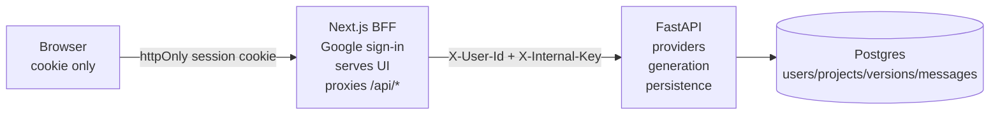

# atoms-demo

Describe an app, ask a question, or revise an existing build. The agent replies
conversationally, streams code when a build is warranted, and runs the generated
single-file HTML app immediately in a sandboxed frame. Every conversation and
generated version is persisted, and build versions stay tagged with the model
that produced them.

## Run it

```bash
cp .env.example .env.local
npx auth secret                    # writes AUTH_SECRET
openssl rand -hex 32               # paste into INTERNAL_API_KEY
# add AUTH_GOOGLE_ID / AUTH_GOOGLE_SECRET and DEEPSEEK_API_KEY
docker compose up
```

- App: http://localhost:3000
- API docs: http://localhost:8000/docs

Google OAuth redirect URI, local:
`http://localhost:3000/api/auth/callback/google`

## Shape



**Next owns the session and nothing else.** Auth.js runs with JWT sessions and
no database adapter — it does the Google dance, puts the `sub` claim in a signed
httpOnly cookie, and forwards it. It has no database connection at all.

**Python owns the product.** The provider registry, streaming generation, HTML
extraction, the strict retry, and all product tables including `users`.

**The browser never talks to FastAPI.** Every call goes through Next's `/api/*`
proxy, server-to-server. Same origin, so there is no CORS, no token in the
browser, and no second thing to authenticate. FastAPI trusts `X-User-Id` only
because `X-Internal-Key` proves the request came from the BFF.

If you ever find yourself adding CORS middleware to the API, something is
calling it from a browser and the trust model has broken.

## Why a single HTML file

Atoms-class tools generate multi-file projects and run them in a container or a
browser VM. That is mostly infrastructure. Constraining the agent to one
self-contained HTML document makes the "runtime" an `<iframe srcdoc sandbox>` —
the browser is the sandbox, and there is nothing to operate.

The cost is generality: no npm packages, no server code, no multi-page apps. A
deliberate trade. See `docs/ARCHITECTURE.md`.

## Layout

| Path | Role |
|---|---|
| `app/` | Next pages and `/api/*` proxy routes |
| `components/` | Workbench and sign-in UI |
| `lib/api.ts` | Server-only path from Next to FastAPI |
| `auth.ts` | Google sign-in with Auth.js JWT sessions |
| `api/agent.py` | Streams the model, splits chat/code, extracts HTML, retries once |
| `api/providers.py` | Provider/model registry |
| `api/models.py` | SQLAlchemy schema: users, projects, versions, messages |
| `docs/` | Architecture and backend decision notes |

## Current status

- Google sign-in through Auth.js JWT sessions.
- FastAPI service with `/models`, `/projects`, `/projects/:id`, and streaming
  `/generate/stream`.
- Persisted projects, message transcripts, generated versions, model ids, and
  optional reasoning text.
- Live SSE updates for reasoning, chat, source code, retry state, and completion.
- Sandboxed iframe preview with a guarded partial renderer for in-progress HTML.

## Known gaps

- **Schema is created with `create_all()` on startup.** Fine for a demo; a real
  deployment gets Alembic. `create_all()` creates missing tables but does not
  alter existing ones, so schema changes need migrations before real data.
- No multi-file generation, no npm packages in generated apps.
- No sharing — every project is private to its owner.
- No automated generated-app repair loop yet. A malformed HTML response gets one
  strict retry, but runtime errors are left for the user to revise.

## Requirement review

The written test asks for a runnable Atoms-style demo with real interactivity,
persistence, a primary user journey, and a public live test link. This repo
covers the local runnable app, Google sign-in, AI-assisted generation, live
preview, revision history, and persistence. Before submission, the remaining
must-do item is deployment: provide the public app URL and public GitHub URL in
the submission document.

Risks to call out honestly:

- Generated apps are constrained to one self-contained HTML file. That keeps the
  demo safe and deployable quickly, but excludes npm packages, server code, and
  multi-page projects.
- Production deployment needs two services: Next.js plus FastAPI/Postgres.
  Environment variables must match across services, especially
  `INTERNAL_API_KEY`, provider keys, Google OAuth callback URLs, and `API_URL`.
- Schema migrations are not implemented. Demo databases can start fresh; a real
  deployment should add Alembic before evolving the schema.
- The app validates generated HTML, but it does not execute tests inside the
  generated app or automatically repair runtime errors.
