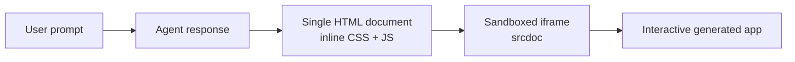
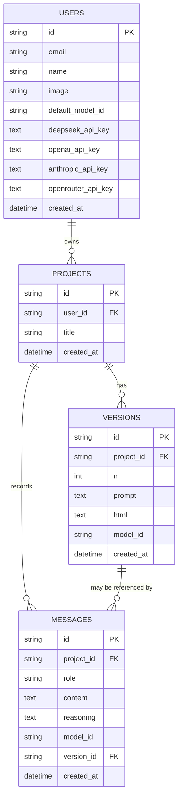
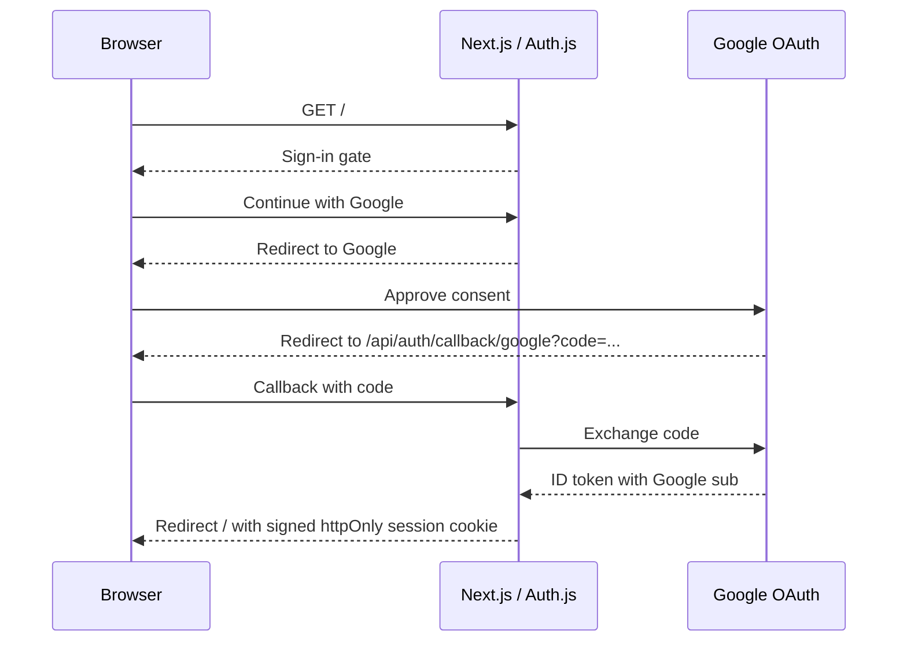
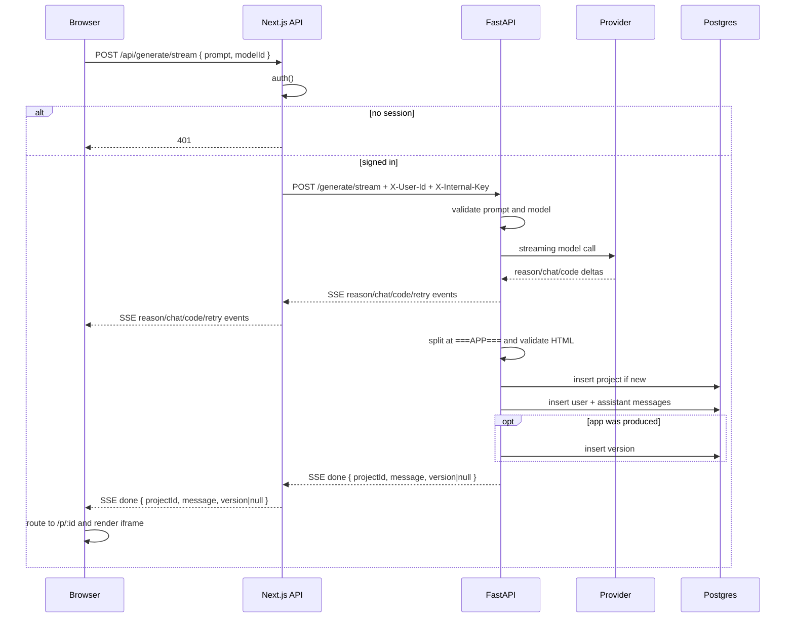
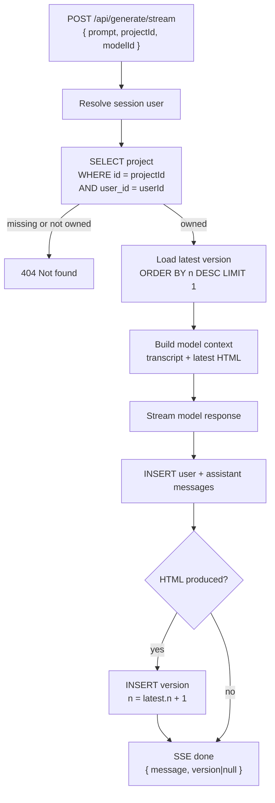
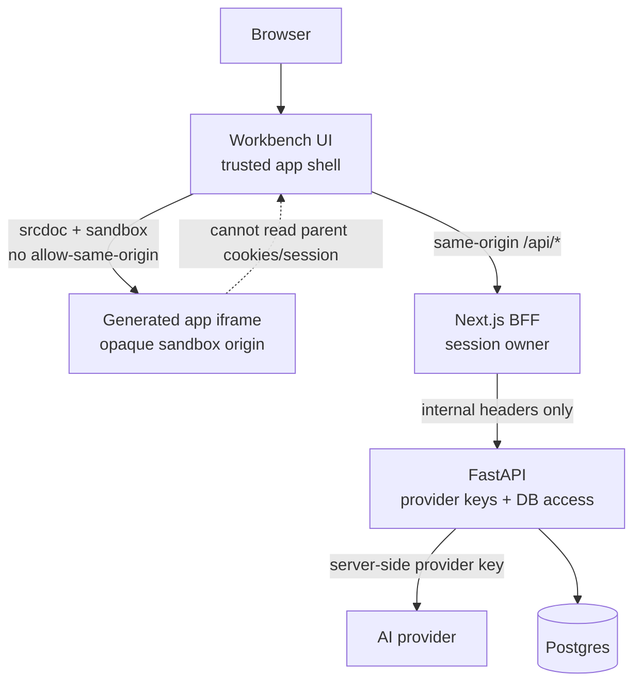

# atoms-demo — Architecture

## The product in one paragraph

A user describes an app, asks a question, or revises an existing build. The
agent answers conversationally first. If a build is warranted, it then streams a
single self-contained HTML document into the UI, where it runs in a sandboxed
iframe. The transcript and every generated version are persisted; versions stay
numbered and tagged with the model that produced them.

---

## 1. The one decision everything else follows from

**The generated artifact is a single self-contained HTML document.**

Atoms-class tools generate multi-file projects and execute them in a container
or a browser VM. That is mostly infrastructure work — a sandboxed runtime to
provision, secure, and keep alive.

Constraining the agent to one HTML file with inlined CSS and JS means the
"runtime" is an `<iframe srcdoc>` with a `sandbox` attribute. The browser is the
sandbox. Nothing to operate.

| | Multi-file + container | Single HTML file |
|---|---|---|
| Preview | Container or WebContainer | `<iframe srcdoc sandbox>` |
| Infra | Orchestration, lifecycle, teardown | None |
| Generality | npm packages, server code, routing | Vanilla JS only, one page |
| Time to first working demo | Days | Hours |

The cost is real and worth stating plainly: **no npm packages, no server code, no
multi-page apps.** This is a deliberate trade, not an oversight. It buys the
headline experience — a real, interactive app appearing in seconds — at a
fraction of the cost.

Everything below is downstream of this.

---

## 2. Data model

Auth.js owns no database tables. It keeps a signed JWT session cookie and
forwards the Google `sub` claim to FastAPI. FastAPI owns four tables:

### Schema Tables

#### `users`

| Column | Type | Constraints | Meaning |
|---|---|---|---|
| `id` | `string` | Primary key | Stable Google `sub` claim |
| `email` | `string \| null` | Unique | Latest email forwarded by Auth.js |
| `name` | `string \| null` |  | Latest profile name |
| `image` | `string \| null` |  | Latest profile image URL |
| `default_model_id` | `string \| null` |  | User's preferred model |
| `deepseek_api_key` | `text \| null` |  | User-provided DeepSeek key |
| `openai_api_key` | `text \| null` |  | User-provided OpenAI key |
| `anthropic_api_key` | `text \| null` |  | User-provided Anthropic key |
| `openrouter_api_key` | `text \| null` |  | User-provided OpenRouter key |
| `created_at` | `datetime` | Server default | First time the user reached FastAPI |

#### `projects`

| Column | Type | Constraints | Meaning |
|---|---|---|---|
| `id` | `string` | Primary key | Build/conversation id |
| `user_id` | `string` | Foreign key to `users.id`, indexed, cascade delete | Owner |
| `title` | `string` |  | Derived from the first prompt |
| `created_at` | `datetime` | Server default | Project creation time |

#### `versions`

| Column | Type | Constraints | Meaning |
|---|---|---|---|
| `id` | `string` | Primary key | Version id |
| `project_id` | `string` | Foreign key to `projects.id`, indexed, cascade delete | Owning project |
| `n` | `integer` | Monotonic within project | User-facing version number |
| `prompt` | `text` |  | Prompt that produced this version |
| `html` | `text` |  | Complete generated HTML document |
| `model_id` | `string` |  | Model that produced the version |
| `created_at` | `datetime` | Server default | Version creation time |

#### `messages`

| Column | Type | Constraints | Meaning |
|---|---|---|---|
| `id` | `string` | Primary key | Message id |
| `project_id` | `string` | Foreign key to `projects.id`, indexed, cascade delete | Owning project |
| `role` | `string` | `"user"` or `"assistant"` | Speaker |
| `content` | `text` |  | Visible prose |
| `reasoning` | `text \| null` |  | Optional provider reasoning channel |
| `model_id` | `string \| null` |  | Assistant turn model id |
| `version_id` | `string \| null` | Foreign key to `versions.id`, set null on delete | Generated version for this turn, if any |
| `created_at` | `datetime` | Server default | Message creation time |

### Why it's shaped this way

**`project → versions[]`, versioned from the first commit.** The obvious v1
model is flat: one prompt, one output, one row. But "revise this app" is the
feature that makes the product feel alive, and bolting it onto a flat table
later means a migration *plus* a UI rewrite. Versioning up front costs one extra
table and makes iteration an `INSERT`.

**`versions` is append-only.** A revision never mutates a prior row. This is what
makes the version chips work: v1 through v4 all still exist, all still run, and
switching between them is a client-side array lookup with no server round trip.
Cheap to build, and it's the thing that makes the demo feel like a real tool.

**`model_id` lives on the version, not in UI state.** Which model built which
revision becomes part of the record. That enables a demo moment most submissions
won't have: build v1 with DeepSeek, v2 with Claude, same app, flip between them
and compare. A UI-only model setting cannot do this.

**`n` is per-project, not global.** Version numbers are meaningful to the user
("v3 of *my todo app*"), so they're scoped to the project. Computed as
`MAX(n) + 1` on insert.

**`title` is derived, not asked for.** Never ask a user to name something before
they've seen it. The first prompt, truncated, is a good enough label — and it's
one less field between intent and result.

**`messages` exists because not every turn produces an app.** A greeting or a
question should be a real persisted turn, not a failed generation. Assistant
messages can point at the version they produced, but the transcript remains the
source of truth for conversation.

### What's deliberately absent

- **No `deleted_at`.** Nothing is deleted in the demo.
- **No `is_current` flag on versions.** The current version is `MAX(n)`. A flag
  would be denormalised state that can disagree with the data.
- **No sharing / visibility column.** Every project is private to its owner.
  Adding public sharing later means one nullable `share_token` column — cheap,
  so it's not worth pre-building.

---

## 3. Data flow

### A. Sign in

The session cookie is `httpOnly`. The browser never handles a token; every
subsequent request carries the cookie automatically.

### B. Build an app (the core loop)

Step 4 is the load-bearing one. The model is told to speak first, then emit
`===APP===` only when it is actually building. Everything before the sentinel is
chat; everything after it is the app source. If the app source does not validate
as a complete HTML document, the backend does one strict retry before surfacing a
readable error.

### C. Revise (the same endpoint)

The only difference is that `projectId` is present in the request:

One endpoint, two behaviours, switched by the presence of `projectId`. The
alternative — separate `/generate` and `/revise` routes — duplicates the auth
check, the extraction, the retry, and the insert. The ownership check and the
"latest version" lookup are the only branch.

### D. Load a saved project

`/p/:id` is a server component. It reads the session, fetches the project, its
versions, and its messages in one server-side pass, and hands them to the client
component as props. The page arrives with the transcript and latest app already
rendered — no loading flash, no client fetch waterfall.

---

## 4. API contract

This is the seam. Any backend that satisfies it can serve the existing frontend.
(See `BACKEND-CHOICE.md`.)

### `GET /api/models`

Which models are usable for the current user. The picker is built from this, so
a provider with no user API key configured simply doesn't appear — it can't be
selected, so it can't fail at generate time.

| Field | Type | Meaning |
|---|---|---|
| `models` | `ModelOut[]` | Models whose provider key is configured |
| `default` | `string \| null` | Preferred model id, or first available model |

`ModelOut`

| Field | Type | Meaning |
|---|---|---|
| `id` | `string` | Stable model id stored on versions/messages |
| `label` | `string` | Human-readable picker label |
| `provider` | `string` | Human-readable provider label |

### `GET /api/settings`

Returns the current user's demo settings. API keys are never echoed back; the
response only tells the UI whether a key exists.

| Field | Type | Meaning |
|---|---|---|
| `defaultModelId` | `string \| null` | Saved default model, normalized to an available model when possible |
| `configured` | `boolean` | Whether at least one provider key exists |
| `keys` | `KeyStatus` | Booleans for saved provider keys |
| `models` | `ModelOut[]` | All known model choices, including unconfigured providers |

`KeyStatus`

| Field | Type | Meaning |
|---|---|---|
| `deepseek` | `boolean` | DeepSeek key has been saved |
| `openai` | `boolean` | OpenAI key has been saved |
| `anthropic` | `boolean` | Anthropic key has been saved |
| `openrouter` | `boolean` | OpenRouter key has been saved |

### `PUT /api/settings`

Updates the current user's default model and any API keys included in the
request. Blank or omitted key fields leave existing saved keys unchanged.

| Field | Type | Required | Meaning |
|---|---|---:|---|
| `defaultModelId` | `string` | Yes | Preferred model id |
| `deepseekApiKey` | `string` | No | New DeepSeek key |
| `openaiApiKey` | `string` | No | New OpenAI key |
| `anthropicApiKey` | `string` | No | New Anthropic key |
| `openrouterApiKey` | `string` | No | New OpenRouter key |

### `POST /api/generate/stream`

Request body:

| Field | Type | Required | Meaning |
|---|---|---:|---|
| `prompt` | `string` | Yes | User message or requested change |
| `projectId` | `string` | No | Present when revising or continuing an existing conversation |
| `modelId` | `string` | No | Preferred model; falls back to configured default |

Final `done` SSE payload:

| Field | Type | Meaning |
|---|---|---|
| `projectId` | `string` | Conversation/build thread id |
| `message` | `MessageOut` | Assistant reply that was saved |
| `version` | `VersionOut \| null` | Generated app version, or `null` for chat-only turns |

Events before `done` are `reason`, `chat`, `code`, `retry`, and `error`.
Chat-only turns return `"version": null`.

| Status | When |
|---|---|
| 400 | empty prompt, or a `modelId` that isn't available |
| 401 | no session |
| 404 | `projectId` doesn't exist **or isn't yours** — same response either way, so the endpoint doesn't leak which |
| 500 / `error` event | the provider failed, save failed, or the model failed validation after retry. Body carries a message the UI shows verbatim. |

### `GET /api/projects`

The current user's projects, newest first. Never anyone else's.

`ProjectOut`

| Field | Type | Meaning |
|---|---|---|
| `id` | `string` | Project id |
| `title` | `string` | Derived project title |
| `createdAt` | `datetime` | Creation time |

### `GET /api/projects/:id`

One project, all versions, and all messages, ascending. 404 if it isn't yours.

| Field | Type | Meaning |
|---|---|---|
| `project` | `ProjectOut` | Project metadata |
| `versions` | `VersionOut[]` | Generated versions in ascending version order |
| `messages` | `MessageOut[]` | Transcript in creation order |

`VersionOut`

| Field | Type | Meaning |
|---|---|---|
| `id` | `string` | Version id |
| `n` | `integer` | Version number within the project |
| `prompt` | `string` | Prompt that produced this version |
| `html` | `string` | Complete generated HTML document |
| `modelId` | `string` | Model that produced this version |
| `createdAt` | `datetime` | Creation time |

`MessageOut`

| Field | Type | Meaning |
|---|---|---|
| `id` | `string` | Message id |
| `role` | `"user" \| "assistant"` | Speaker |
| `content` | `string` | Visible message text |
| `reasoning` | `string \| null` | Optional provider reasoning text |
| `modelId` | `string \| null` | Assistant turn model id |
| `versionId` | `string \| null` | Version produced by this turn, if any |
| `createdAt` | `datetime` | Creation time |

---

## 5. Trust boundaries

**The generated HTML is untrusted input.** A model wrote it, and a user's prompt
steered the model. It runs in an iframe with an explicit `sandbox` attribute
(`allow-scripts allow-forms allow-modals`) and *without* `allow-same-origin` —
so the frame gets a unique opaque origin and cannot touch the parent document,
its cookies, or its session. This is the single most important line in the
frontend.

The system prompt also forbids network calls and remote resources. That is a
quality instruction, not a security control — a model can ignore it. The sandbox
attribute is the control.

**A project id is not authorisation.** Every read and write of a project
re-checks `user_id` against the session server-side. Never trust the id in the
URL.

**Provider keys are workbench-only settings, never generated-app inputs.** The
user enters keys through the trusted workbench UI. They are stored on the user
record and used only by FastAPI when calling providers. The generated iframe
receives only HTML, never provider credentials.

---

## 6. Failure modes and what happens

| Failure | Behaviour |
|---|---|
| User greets or asks a question | Chat-only turn is saved; no version is written |
| Model starts a build but returns malformed HTML | Extractor strips it; if still invalid, one strict retry; then a readable error suggesting another model |
| Model times out | SSE `error` event with the provider's message; the version is never written, so no half-built rows |
| Provider key missing | The model never appears in the picker |
| Two builds fired at once | The button is disabled while `working`; the server would tolerate it (append-only, `MAX(n)+1`) but the UI prevents it |
| Generated app throws at runtime | It breaks inside the iframe only. The workbench is unaffected. The user reads the error, revises, gets v2. |

That last row is the point of the whole design. A broken generated app is a
normal, recoverable event — not an outage.
