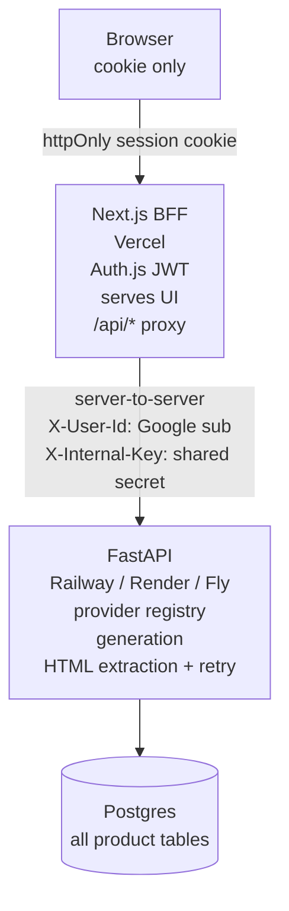

# Backend: Next.js only, or a Python service?

Written before committing, so the decision is a choice rather than a drift.

---

## What is actually being decided

The API contract in `ARCHITECTURE.md` §4 is fixed. The question is only *what
serves it*. Three options:

| | A. Next.js only | B. Next + FastAPI (proxied) | C. Next + FastAPI (direct) |
|---|---|---|---|
| Browser talks to | Next | Next only | Next **and** FastAPI |
| Generation runs in | Next route handler | Python | Python |
| Owns the schema | Drizzle (TS) | SQLAlchemy (Python) | SQLAlchemy (Python) |
| CORS | none | none | yes, must configure |
| Auth across the boundary | n/a | none needed — server-to-server | must forward + verify a token |
| Deployables | 1 | 2 | 2 |
| Hosts | Vercel | Vercel + Railway/Render/Fly | Vercel + Railway/Render/Fly |
| Extra build time | — | ~1.5–2 h | ~3 h |

**Option C is the one to avoid.** It's the shape people reach for by default, and
it's the most expensive: the browser holds a token, FastAPI has to verify it, and
you're configuring CORS and debugging preflights at hour six. It buys nothing
over B.

---

## Option B in detail — the version worth building

The trick is to stop thinking of Next as "the frontend" and start thinking of it
as the **BFF** (backend-for-frontend): it owns the browser session and nothing
else. Python owns the product.



### The three things that make it cheap

**1. Auth.js drops its database adapter.**

Currently Auth.js uses database sessions and owns four tables. In this split it
switches to **JWT sessions** — no adapter, no tables, no Postgres access from
Next at all. It does the Google OAuth dance, gets the user's stable Google `sub`
and email, and puts them in a signed cookie. That's its entire job.

Python then owns *every* table, including `users`, keyed by the Google `sub`.
One schema, one migration tool, one language. This is a cleaner separation than
what we have today, not a messier one.

**2. The browser never talks to FastAPI.**

Next's `/api/*` routes become a proxy: read the session, attach the user id and
an internal shared secret as headers, forward to FastAPI, stream the response
back. Same origin, so no CORS, no preflight, no token in the browser.

FastAPI trusts `X-User-Id` **only** because it also verifies `X-Internal-Key`,
and because it isn't reachable from the public internet in any path the UI uses.
That's the whole auth story across the boundary — about fifteen lines.

```python
# api/deps.py
def current_user(
    x_user_id: str = Header(...),
    x_internal_key: str = Header(...),
) -> str:
    if not secrets.compare_digest(x_internal_key, settings.INTERNAL_KEY):
        raise HTTPException(401)
    return x_user_id          # upsert into users on first sight
```

**3. Docker Compose absorbs the extra service.**

Locally, "two services" costs one more block in a file you already have:

```yaml
services:
  db:   { … }                     # unchanged
  api:  { build: ./api, … }       # FastAPI, port 8000
  web:  { build: ., … }           # Next, port 3000, API_URL=http://api:8000
```

`docker compose up` still brings the whole thing up with one command. The local
story does not get worse.

### Where it does cost you

- **A second production deploy.** Vercel does not host FastAPI comfortably.
  You need Railway, Render, or Fly for the API, with its own env vars and its own
  URL. Budget an hour for the first successful deploy including the inevitable
  "it works locally" round.
- **A second dependency tree.** `requirements.txt`/`pyproject.toml` alongside
  `package.json`. Two lockfiles, two CI paths if you add CI.
- **Latency.** One extra network hop on every call. Irrelevant next to a
  10–30 second model call.

---

## What Python actually buys

Be honest about this, because it's the crux.

**It does not make the current feature set better.** Calling DeepSeek's
OpenAI-compatible endpoint and inserting two rows is equally trivial in either
language. If the app shipped today were the final state, Option A wins on every
axis.

**It buys headroom for where this kind of product goes next:**

- **Multi-step agent loops.** Generate → run → read the error → repair, in a
  loop with tool calls. Python's agent tooling (LangGraph, Pydantic AI, plain
  asyncio) is more mature than the TS equivalents, and this is the natural next
  feature.
- **Background work.** Generation is a 10–30 second operation. Today it's a
  blocking request, which is fine. The moment it becomes a queued job with
  progress streaming, Python has better answers (Celery, ARQ, or just asyncio
  tasks) than a Vercel route handler, which has a hard execution ceiling.
- **Anything numeric or ML-adjacent** — evaluating generated apps, embedding and
  searching past builds, scoring model outputs against each other.

**And it buys a demonstration.** The role is full-stack. A submission that shows
a considered service boundary, a typed contract between two languages, and a
working Compose file is showing more engineering surface than one that shows a
single Next app — *provided it's finished*. An unfinished split is worse than a
finished monolith on every criterion they listed.

---

## Current implementation

Option B is the implementation now. Next.js is the BFF, Auth.js uses JWT
sessions without a database adapter, and FastAPI owns generation plus the
`users`, `projects`, `versions`, and `messages` tables. User-level provider
configuration also lives on `users`, so provider keys are set in the app instead
of process environment variables.

The seam also moved from a blocking `/generate` JSON route to streaming
`/generate/stream` SSE. The browser still talks only to Next; Next forwards the
request body and streams FastAPI's events back unchanged after verifying the
session.

---

## Concrete shape

| Path | Role |
|---|---|
| `api/main.py` | FastAPI app, CORS off, routes mounted |
| `api/deps.py` | `current_user()` service-boundary auth |
| `api/models.py` | SQLAlchemy schema for `users`, `projects`, `versions`, `messages` |
| `api/schemas.py` | Pydantic request/response models |
| `api/providers.py` | Registry for DeepSeek, OpenAI, OpenRouter, Anthropic |
| `api/agent.py` | `converse()` streams reason/chat/code, extracts HTML, retries once |
| `api/routes/stream.py` | `/generate/stream` SSE endpoint |
| `api/routes/projects.py` | Project list/detail endpoints |
| `api/routes/models.py` | Available models endpoint |
| `api/requirements.txt` | Python dependency list |

`providers.py` keeps one registry and two adapters. DeepSeek, OpenAI, and
OpenRouter share the OpenAI-compatible client; Anthropic uses its own SDK.

The largest remaining backend shortcut is schema management: startup calls
`create_all()` and applies a tiny settings-column patch, which is acceptable for
this demo but not enough for production changes to existing tables. Alembic is
the obvious next step.
